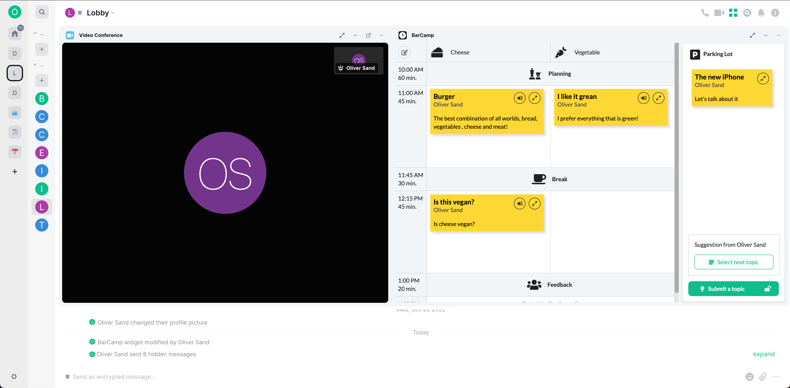
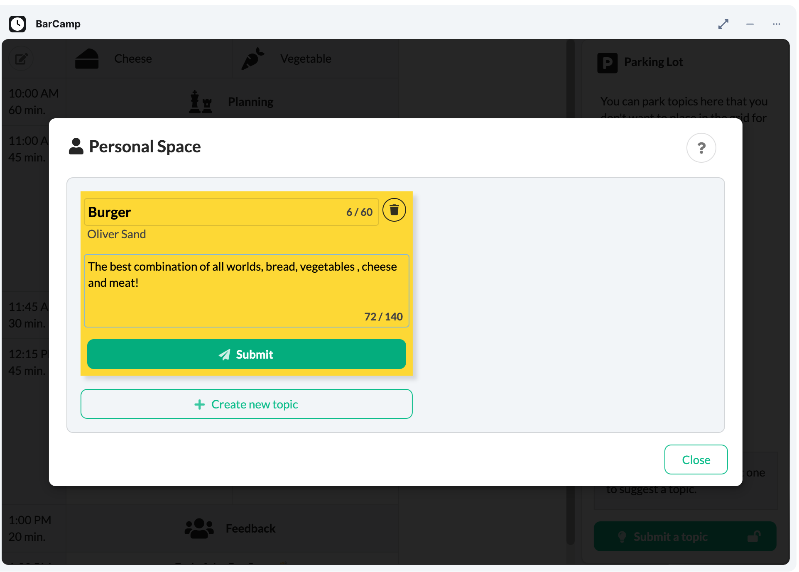
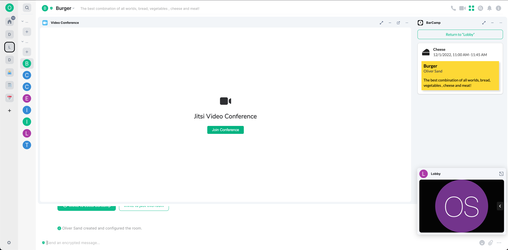
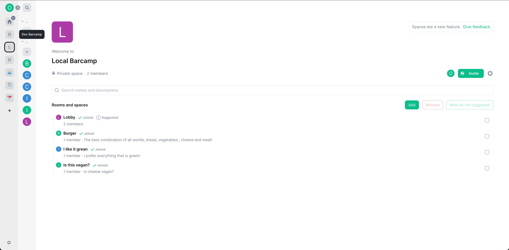

# Matrix BarCamp

[](https://github.com/nordeck/matrix-barcamp/actions/workflows/ci.yml)

A widget for organizing [Barcamps](https://de.wikipedia.org/wiki/Barcamp) in [Matrix](https://matrix.org/) chat rooms.


<table>
  <tr>
    <td>
      
    </td>
    <td>
      
    </td>
  </tr>
  <tr>
    <td>
      
    </td>
    <td>
      
    </td>
  </tr>
</table>

Learn more details about the design of the widget in the [Background](./docs/background.md) or the [Architecture Decision Records](./docs/adrs/).

## How to Use

1. Create a new Matrix Space.
2. Create a “Lobby” room to plan your agenda.
   Tip: Emojis in room names “🗓 Lobby” make it easy to identify the room.
3. Follow the steps at `https://<widget-url>` to setup the first room.
4. Invite other users to the space, create your agenda, and enjoy your Barcamp.

## Demo

Till now there is no officially hosted demo of the widget.
See the [Deployment](#deployment) section on how you can host the widget on your own.

## Getting Started

Development on the widget happens at [GitHub](https://github.com/nordeck/matrix-barcamp).

### How to Contribute

Please take a look at our [Contribution Guidelines](https://github.com/nordeck/.github/blob/main/docs/CONTRIBUTING.md).
Check the following steps to develop for the widget:

### Requirements

You need to install Node.js (`>= 16.0.0`, prefer using an LTS version) and run
`yarn` to work on this package.
The minimal Element version to use this widget is `1.11.8`.

### Installation

After checkout, run `yarn install` to download the required dependencies

> **Warning** Do not use `npm install` when working with this package.

### Configuration

Rename the provided `.env.local.default` to `.env.local` and fill it with your configuration.
For a list of available options, see [Configuration](./docs/configuration.md).

### Running the Widget Locally

Follow the [instructions to run the widget locally](https://github.com/nordeck/matrix-widget-toolkit/tree/main/example-widget-mui#running-the-widget-locally).
Visit `http(s)://localhost:3000/` and follow the further instructions.

### Available Scripts

In the project directory, you can run:

- `yarn dev`: Start the widget for development.
- `yarn start`: Start the widget for development with a self-signed HTTPS certificate.
- `yarn build`: Build the production version of the widget.
- `yarn test`: Watch all files for changes and run tests.
- `yarn tsc`: Check TypeScript types for errors in the widget.
- `yarn lint`: Run eslint on the widget.
- `yarn prettier:write`: Run prettier on all files to format them.
- `yarn depcheck`: Check for missing or unused dependencies.
- `yarn deduplicate`: Deduplicate dependencies in the `yarn.lock` file.
- `yarn changeset`: Generate a changeset that provides a description of a
  change.
- `yarn translate`: Update translation files from code.
- `yarn generate-disclaimer`: Generates license disclaimer and include it in the build output.
- `yarn docker:build`: Builds a container from the output of `yarn build` and `yarn generate-disclaimer`.
- `yarn e2e`: Runs the end-to-end tests in a single browser. Pass `--debug` to enable the debug UI.

### Versioning

This package uses automated versioning.
Each change should be accompanied with a specification of the impact (`patch`, `minor`, or `major`) and a description of the change.
Use `yarn changeset` to generate a new changeset for a pull request.
Learn more in the [`.changeset` folder](./.changeset).

Once the change is merged to `main`, a “Version Packages” pull request will be created.
As soon as the project maintainers merged it, the package will be released and the container is published.

### Architecture Decision Records

We use [Architecture Decision Records (ADR)s](https://github.com/nordeck/matrix-widget-toolkit/blob/main/docs/adrs/adr001-use-adrs-to-document-decisions.md) to document decisions for our software.
You can find them at [`/docs/adrs`](./docs/adrs/).

## Deployment

Yon can run the widget using Docker:

```sh
docker run --rm -p 8080:8080 ghcr.io/nordeck/matrix-barcamp-widget:latest
```

We also provide a [HELM chart](./charts/).

## License

This project is licensed under [APACHE 2.0](./LICENSE).

The disclaimer for other OSS components can be accessed via the `/NOTICE.txt` endpoint.
The list of dependencies and their licenses are also available in a maschine readable format at `/usr/share/nginx/html/licenses.json` in the container image.

## Sponsors

<p align="center">
   <a href="https://digitales.sh/"></a>
   &nbsp;&nbsp;&nbsp;&nbsp;
   <a href="https://www.dphoenixsuite.de/"></a>
   &nbsp;&nbsp;&nbsp;&nbsp;
   <a href="https://www.dataport.de/"></a>
</p>

The [Zentrales IT-Management Schleswig-Holstein](https://digitales.sh/) initiated and sponsored this project.
This project is part of the [dPhoenixSuite by Dataport](https://www.dphoenixsuite.de/).
