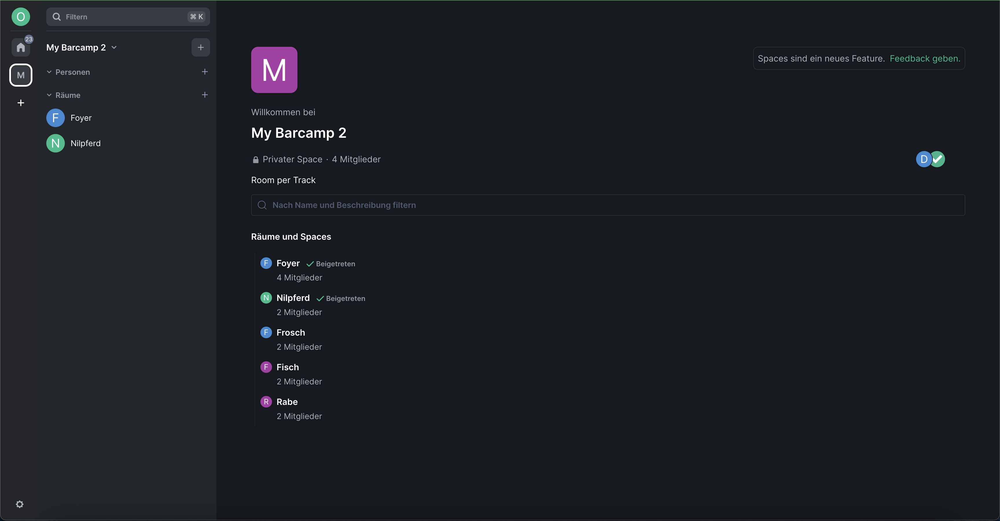
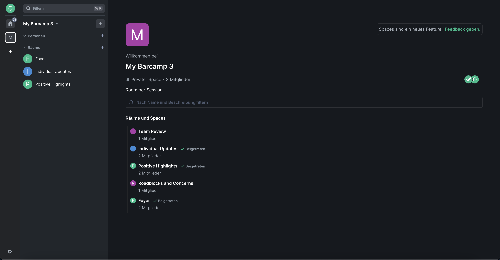
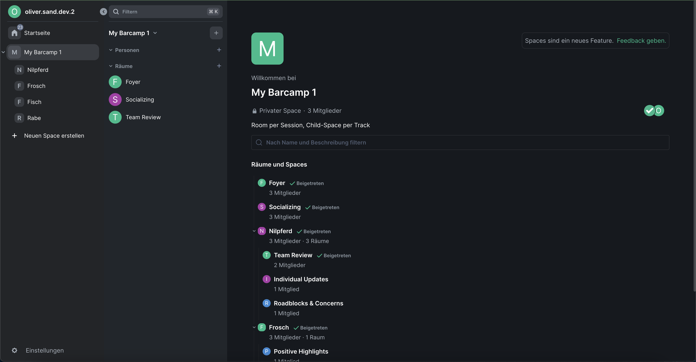
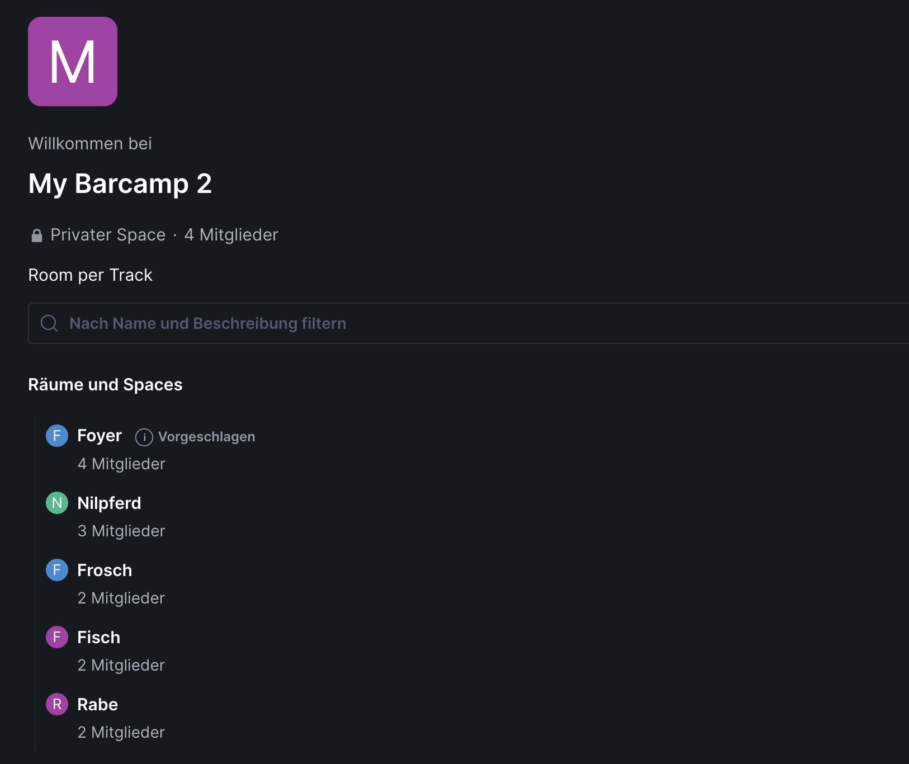
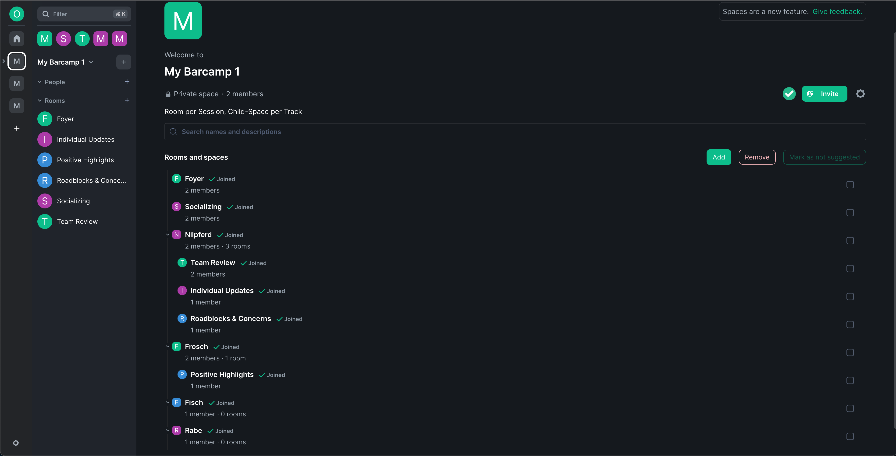

# ADR003: Space and Room Structure of a Barcamp

Status: accepted

<!-- These documents have names that are short noun phrases. For example, "ADR001: Deployment on Ruby on Rails 3.0.10" or "ADR009: LDAP for Multitenant Integration" -->

## Context

<!--
This section describes the forces at play, including technological, political, social, and project local. These forces are probably in tension, and should be called out as such. The language in this section is value-neutral. It is simply describing facts. -->

A BarCamp is an open, participatory workshop-event with no fixed agenda.
The participants bring discussion topics and discuss them in different sessions.
On-site BarCamps are held in physical locations that provide a number of event rooms.
This limits the amount of parallel tracks and the participant capacity in each session.
Each room hosts a session in one of the defined time slots of the BarCamp.
There are also common events that are used to collaboratively create the agenda or for breaks.
There are also socializing rooms (for coffee or catering) outside of the workshop rooms.

Our BarCamp platform aims to bring the same kind of event into the virtual world based on the Matrix protocol.
There should be virtual chat rooms which are the equivalent to physical rooms in a building.
Different to a physical room, users can be member of multiple rooms at once, but can only actively participate in a single room.
By default, Matrix rooms are independent from each other, but the protocol has the concept of [spaces][msc_1772], which could be used to group multiple rooms to improve discoverability.

## Decision

<!-- This section describes our response to these forces. It is stated in full sentences, with active voice. "We will ..." -->

We will create a Matrix space for each BarCamp event that contains everything related to a specific BarCamp.
The BarCamp space has a name, a description, and an avatar.
The space contains a lobby room where the participants create the agenda.
There might also be additional Matrix rooms that are used for other common events, or socializing rooms that are independent from the tracks and sessions.

We will create rooms per sessions, to have a single room history for each session.
We might use child-spaces in the future to improve the structure of the BarCamp, however, right now the child-spaces aren't ready for general usage.
We expect that an organizer of a BarCamp creates the Matrix rooms by hand and assigns them to the sessions.
We might automate this process with a bot or other processes in the future.

### Space Layouts

There are three alternative variants for the room structure for the sessions:

- A matrix room per track, as part of the root space.
- A matrix room per session, as part of the root space (preferred).
- A matrix room per session, sorted into child-spaces of the root space for each track.

Let's discuss the details of each alternative for the room structure for the sessions:

#### Room per Track

In this variant, we have a Matrix room for every track.
This is the most similar to physical rooms.
Users only join track rooms on demand.
The session grid is used to discover the rooms.

```
Root Space: My BarCamp
├── Room: Lobby
├── Room: Socializing (other optional rooms…)
├── Room: Nilpferd
├── Room: Frosch
⋮
```



This approach has some good points:

- It is easy to setup manually because the moderator knows beforehand which rooms he has to create.
  The moderator wants to configure name, description, (maybe avatar), as well as widgets.
- This approach is similar to the physical world, with the same limitations.
  For example, each room can only have a single running session at a time.
  This makes sure that sessions are ended before a new one is started.
- One can stay in a room all day and float from session to session if one doesn't know which sessions to attend.

But also has some bad points:

- All data, e.g. chat messages, whiteboard content, etc. is shared between all sessions inside the track.
  You don't know which information in the room belong to which session.
  This can lead to confusion.
  Removing the information at the end of the session might be undesired, as the room couldn't be used as an archive for the results anymore.
- Users that joined the track room stay in the track room for the full BarCamp.
  They also get notifications of messages in session that they don't participate.
  This can lead to an information overload for the users.

#### Room per Session

In this variant, we have a Matrix room for every session.
Users only join session rooms on demand.
The session grid is used to discover the rooms.

```
Root Space: My BarCamp
├── Room: Lobby
├── Room: Socializing (other optional rooms…)
├── Room: Team Review
├── Room: Individual Updates
├── Room: Roadblocks & Concerns
├── Room: Positive Highlights
⋮
```



This approach has some good points:

- We don't limit ourselves to the limits of the physical world and use the full potential of the Matrix protocol.
- Data is separated between each session.
  Each session starts from scratch, previous messages and widget content (for example whiteboard or etherpad) is not shared.
  It's easy to see what data belongs to a session.
- Users only receive notifications for rooms that they take part of, which reduces information overload.
- It's easy to see how many users joined a session.

But also has some bad points:

- This setup requires more rooms to setup.
- Moderators only know which rooms to setup after the full schedule is completed on the session grid.
  After that they can start to create rooms, which can take a while if done manually.
  They have to finish at least the creation of the rooms of the first time slot so that the BarCamp can start and can defer creating the other rooms for the later time slots.
- There is no limit for running sessions in parallel, a session in the same track can already start while the other one is not yet completed.
  This is both a pro and con:
  Users can decide to extend discussion, but can also leave every time they think the discussion is not helpful.
  But on the other hand, subsequent sessions might miss participants as they are still in the previous session.
  There are other approaches we can take, like reminding the users via a bot that the session ends soon, that the session ended, or we could even limit the conversation in the room using power levels once the time is up (with a small grace period).
- As this variant spawns a lot of rooms, this can become a bit unorganized and hard to overlook.
  The user can't see the track structure inside the room list, but is still able to see it inside the session grid.
  On the other hand, users only join the room they participate in and therefore only have to deal with a limited set of rooms.

#### Room per Session, Child Space per Track

This variant is an extension of the [_Room per Session_](#room-per-session) variant.
We have a Matrix room for every session.
To better organize the sessions, we create child spaces under the root space that represent the tracks with the related rooms.
The child-spaces should give more structure into the collection of rooms.
Users automatically join every child-space, but only join session rooms on demand.
The session grid is used to discover the rooms.

```
Root Space: My BarCamp
├── Room: Lobby
├── Room: Socializing (other optional rooms…)
├── Child-Space: Nilpferd
│   ├── Room: Team Review
│   ├── Room: Individual Updates
│   ├── Room: Roadblocks & Concerns
├── Child-Space: Frosch
│   └── Room: Positive Highlights
⋮
```



This approach has some good points:

- The points from the _Room per Session_ variant, plus:
- The subspaces give more structure and also show the structure of the tracks inside the Element messenger itself, not just inside the session grid.

But also has some bad points:

- The points from the _Room per Session_ variant, plus:
- This variant requires even more work to setup, as we also need to setup the spaces.
  To set the order of child-spaces correctly, it's required to use the devtools right now which we can expect from a moderator.
- Right now, there is no auto-join into the child-spaces, which means the user can't see everything automatically.
  Also, joining into a room inside a child-space, doesn't force the user to join into the child-space, resulting in the room to be located outside of the root space.
  The spaces feature in general is in a very early state and might not be ready for such complex scenarios.
- It's more more complicated for the BarCamp widget to read events from other rooms, if the room structure is nested.
  However, this depends on where we want to store the events for the widget.

## Consequences

<!-- This section describes the resulting context, after applying the decision. All consequences should be listed here, not just the "positive" ones. A particular decision may have positive, negative, and neutral consequences, but all of them affect the team and project in the future. -->

With the decided structure, let's have a look on how users interact with the structure.

### Running a BarCamp

To perform a BarCamp, a technical setup has to be done by a moderator before the BarCamp starts.
This includes:

- Creating a space for the BarCamp,
- Creating the rooms inside the space.

Our goal is to start with a manual approach and make it very easy to setup.
Automation would only be fully possible using a bot, however, that is something we don't want to implement at the moment.
We only want the user to perform operations that he can do as moderator with the Element UI, without accessing special tools like the devtools.
The devtools might be disabled in some environments and require to much knowledge to use them.
All other parts should be automated by the BarCamp widget.

#### Create a BarCamp Space

To setup a BarCamp, the moderator has to first setup a Matrix space.

1. The moderator creates a new space.
   Either a public or private space can be created.
   The moderator can choose a name, description and icon.
2. Inside the space, the moderator needs to create a lobby room that is the central room of the space.
   The moderator can choose a name for that room freely.
   The lobby room is the room in which the common events are performed.
   The moderator adds the BarCamp widget to the lobby using the `/addwidget …` command.
   Once added, the widget runs the moderator through a setup process for the lobby room and space.
   This can include the configuration of power levels or suggested rooms.
   It's up to the moderators's choice, whether he wants to encrypt the room or not.
3. The moderator can add additional socializing rooms to the space, that are not part of the agenda.
   This can also include moderation or hidden rooms that are only accessible to certain users.

### Creating Rooms for Sessions

The moderator needs to link the Matrix rooms to sessions, so that users can use the session grid to navigate into the rooms.
In addition, rooms need to be setup for each session by providing a title, description, and configuring widgets.

The following process could be implemented:

1. Create a Matrix room.

   > We are currently unable to create rooms using the widget API, so the user has to perform the operation manually.

   The moderator manually creates Matrix rooms that are later linked to sessions.
   Each room should be part of the space and is configured to be visible for all space members.
   It's up to the moderators's choice, whether he wants to encrypt the room or not.
   The room name is not important and is later updated by the widget.
   To speed up the process, the moderator could create a specific amount of empty rooms (based on the time slots times the tracks) beforehand.
   A manual for these steps could be displayed inside the room linking dialog of the widget.

2. Once a session is placed in a time slot of the session grid, the moderator is informed that a session has no room assigned, for example by showing an exclamation mark icon on the topic.
   A session that has no room assigned can not start.
3. The moderator can then link a Matrix room to the session using the UI.
   For that, the UI displays him a list of available rooms.
   Rooms are available if they are not yet linked to any session, if the moderator has joined the room, and if the moderator can administrate the room (has the required power levels in the room).

   > Power levels in the root space are not automatically valid in the subspaces/subrooms. This is unfortunate if there are multiple organizers that should be admin in every room (see [MSC 2962](msc_2962)).

   The widget automatically setups the room, by setting the title, description and installing widgets. The installed widget for now only include the BarCamp widget, but could be extended with jitsi, whiteboard, or etherpad.
   Once linked, the room id is stored in the session to later jump to the room.
   Sessions that are removed from the grid, for example by moving the topic to the parking lot, keep their linked room forever.
   This is important as we want to avoid changing the room configuration afterwards.

We have to find a solution for changes to title and description of a session that are preformed after the room was linked.
We can only sync them directly if the user that performs them in member and administrator of the room.

#### Using the Session Grid to Navigate to Sessions

Once the session grid is completed, users can use the grid to join into sessions.
Each session should have a join room button that the user can click.
The button should navigate the user to the room.
If the user isn't member of the room yet, the user can join the room.

### Related Topics

There are some related topics to discuss:

#### Automatic Joining of Rooms

Users can not join rooms automatically.
While Element creates a `auto_join` property inside `m.space.child` events, it's currently not used.
This makes it difficult to force users into rooms, like the lobby room where the session grid widget is located and the event started.
From there, users can use the session grid to navigate into other rooms.
For now, one alternative is to mark the lobby room at least as a suggested room.

##### Suggested Rooms (and Spaces)

The `m.space.child` events support a `suggested` property which shows rooms with a label that suggests to join them.
The suggested rooms are displayed in the space overview and left sidebar.
We can use it as an alternative to the missing `auto_join` support.



#### Order of Rooms and Child-Spaces

Child rooms and spaces of a space can be ordered.
We can use this to display them in a similar structure and order as we display them in the session grid.
This makes it easier for users to find rooms.
This can be done by setting the `order` property inside of `m.space.child` events.
The order is displayed in the space overview.
However, the order is not used for rooms in the left sidebar (but for spaces) because rooms are either sorted by alphabet or recent activity.



[msc_1772]: https://github.com/matrix-org/matrix-spec-proposals/blob/main/proposals/1772-groups-as-rooms.md
[msc_2962]: https://github.com/matrix-org/matrix-spec-proposals/pull/2962

<!-- This template is taken from a blog post by Michael Nygard http://thinkrelevance.com/blog/2011/11/15/documenting-architecture-decisions -->
