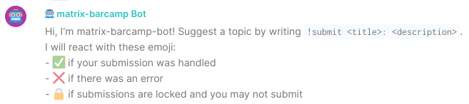

# Matrix BarCamp Bot

This bot accompanying the BarCamp widget to support clients without support for the required widget API calls.



## How to Use

1. Invite the bot to your barcamp room
2. Send `!help` to learn the bot's syntax
3. On your not-widget-enabled device, send `!submit <title>: <description>`, replacing `<title>` by the title and `<description>` by the intended description of your topic submission
4. Watch the bot react to your submission and the topic appearing in the widget

## Getting Started

Development on the widget and bot happens at [GitHub](https://github.com/nordeck/matrix-barcamp).

### How to Contribute

Please take a look at our [Contribution Guidelines](https://github.com/nordeck/.github/blob/main/docs/CONTRIBUTING.md).
Check the following steps to develop for the widget:

### Requirements

You need to install Python and pip. This was tested with Python 3.10.9 and pip 22.3.1.

We suggest you set up a [Python virtual environment](https://docs.python.org/3/library/venv.html).

### Installation

After checkout, run `pip install -r requirements.txt` to install the required dependencies.

### Configuration

Rename the provided `config.toml.sample` to `config.toml` and fill it with your configuration.
In particular, it needs the homeserver, username, and password that your bot should use.

At this time, encryption is not supported.

### Running the Bot Locally

1. Enter your virtual environment, e.g. `source venv/bin/activate`
2. Run the bot `python main.py`

## Deployment

Yon can build and run the widget using Docker:

```sh
docker build --tag=ghcr.io/nordeck/matrix-barcamp-bot:latest .
# copy config.toml.sample to config.toml and edit your credentials
docker run --rm -it \
--mount type=bind,source=$(pwd)/config.toml,dst=/usr/src/app/config.toml \
--mount type=bind,source=$(pwd)/session.txt,dst=/usr/src/app/session.txt \
ghcr.io/nordeck/matrix-barcamp-bot:latest
```
